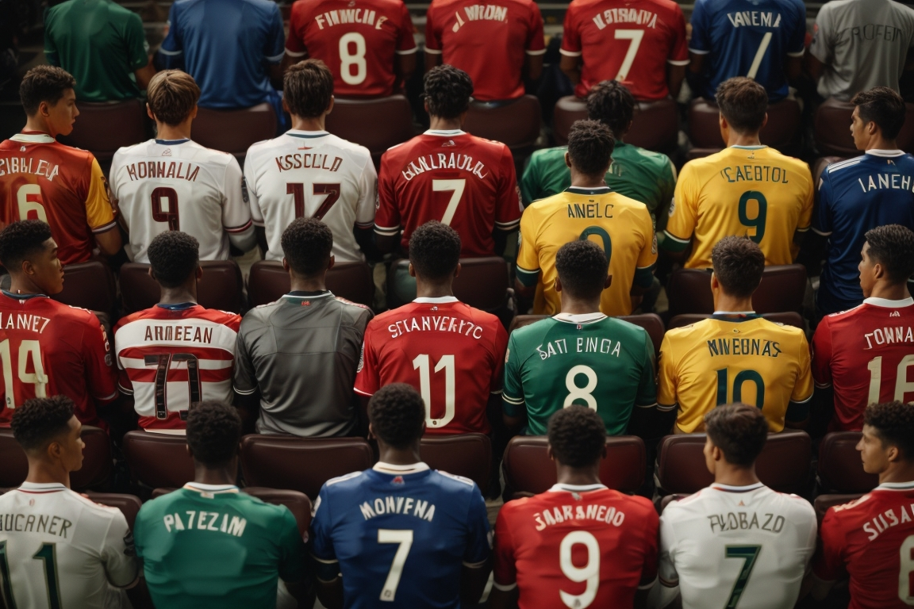

# Favorite Sports Teams Survey Analysis

## Introduction

This README provides an overview of the "Favorite Sports Teams Survey" project conducted as part of a college assignment. The project aimed to gather insights into the preferred sports teams among the participants and analyze the collected data to identify trends and preferences.

## Table of Contents

- [Project Goals](#project-goals)
- [Methodology](#methodology)
- [Data Collection](#data-collection)
- [Data Analysis](#data-analysis)
- [Key Findings](#key-findings)
- [Limitations](#limitations)
- [Conclusion](#conclusion)
- [Contact Information](#contact-information)

## Project Goals

The primary goals of the survey were:

1. **Collect Data:** Gather information about participants' favorite sports teams across different sports.
2. **Analyze Preferences:** Analyze the collected data to identify the most popular sports and teams among the participants.
3. **Visualize Insights:** Create visualizations to represent the distribution of preferences.

## Methodology

The survey was conducted using an online survey platform and distributed among college students. Participants were asked to indicate their favorite sports teams in various categories, including football, basketball, baseball, and others. The survey also included demographic questions such as age, gender, and sports interests.

## Data Collection

- **Participants:** A total of 130 college students participated in the survey.
- **Demographics:** Participants were from diverse backgrounds, with varying ages and genders.
- **Sports Categories:** Participants were asked to provide their favorite teams in each of the specified sports categories.

## Data Analysis

The collected data was analyzed using descriptive statistics and data visualization techniques. The analysis included the following steps:

1. **Time to Complete Analysis:** Calculating the average time taken to complete the survey.
2. **Demographic Analysis:** Analyzing demographic factors such as age, gender, and education.
3. **Favorite Teams Analysis:** Identifying the most favored sports teams and their distribution.
4. **Correlation Analysis:** Exploring correlations between variables, such as age and frequency of watching games, importance of winning, motivation to support the team, etc.
5. **Chi-Square Tests:** Conducting chi-square tests to examine relationships between categorical variables.
6. **Visualization:** Creating various types of visualizations, including pie charts, bar charts, and stacked bar charts.

## Key Findings

1. **Popular Teams:** The survey revealed that "Al Ahly" and "Zamalek" were among the most favored sports teams.
2. **Demographic Patterns:** Gender and age were found to have significant associations with preferences and behaviors related to sports teams.
3. **Correlations:** Several interesting correlations were found between variables such as age, frequency of watching games, importance of winning, motivation to support the team, and feeling when losing.

## Analysis Code

You can find the Python analysis code used for this project in the [Analysis.ipynb](Analysis.ipynb) file in this repository.

## Limitations

- **Sample Bias:** The survey's participants were predominantly college students, which might not represent a diverse range of demographics.
- **Limited Scope:** The analysis focused on a specific set of sports categories and factors; other factors might also influence sports preferences.

## Conclusion

The "Favorite Sports Teams Survey" project provided valuable insights into the preferences of college students regarding sports teams. The analysis highlighted popular teams, demographic patterns, and correlations between variables. This project demonstrates the power of data analysis in understanding sports-related preferences among specific demographics.

## Contact Information

For further information or inquiries, please contact:
[Adham Nasser](mailto:adhamxiii10@gmail.com)

